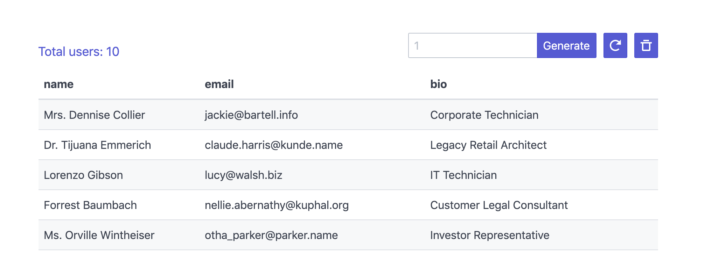

# Service API tutorial - Sinatra

## Prerequisites

- You must complete part 1 first, with 2 droplets and a database up and running on DO

## Step 1 - Create databases remotely

Navigate to the `./service-api-sinatra` directory and create the databases using `rake` on your local machine

*Replace `$DB_HOST` with the public address of the database (looks something like this: `postgres-sinatra...db.ondigitalocean.com`)*

*Replace `$DB_PASSWORD` with the database `doadmin` user password*

**Do this for production as well**

```bash
rake db:create DB_HOST=$DB_HOST DB_PASSWORD=$DB_PASSWORD RACK_ENV=development
```

This will create these databases: `srv_api_dev` and `srv_api_test`

Then migrates the `User` table:

**Do this for production as well**

```bash
rake db:migrate DB_HOST=$DB_HOST DB_PASSWORD=$DB_PASSWORD RACK_ENV=development
```

## Step 2 - Implement Service API

- Implement `GET /users`
  - This route is responsible for returning all the users in the database
  - It should returns an array of users in `json` format
  - Don't leak the user's password!!

- Implement `POST /users?n=10`
  - This route is responsible for creating fake users in the database
  - It should take a query parameter `n` which denotes the number of users to be created
  - If no parameter was given, create 1 user.
  - Returns a `200 OK` if it was successful
  - Returns a `400 Bad Request` if requested more than 30!
  - Hint: use [faker](https://github.com/faker-ruby/faker) to generate random data

- Implement `POST /users/destroy`
  - This route is responsible for removing every user in the database if called.
  - Returns a `200 OK` if it was successful
  - Returns a `500 Internal Error` if it failed

## Step 3 - Implement Frontend



Homepage

- This page should show the following things:
  - Table of all users
  - Total number of users
  - A field that takes in a number (for generating users)
  - A "generate" button that send a `POST` request to `http://API_HOST/users` for generating more users.
  - A "refresh" button for getting the current user table
    - `<a href="/">Refresh</a>`
  - A "destroy" button for removing all the user in the database
    - Does a `POST` to `http://API_HOST/users/destroy`
- Hint: use `Net::HTTP.get` or `xhttp` to call your service API

## Step 4 - Running locally

To connect to the remote database, you should always run your apps like this:

```bash
# For service-api, running on port 4568
DB_HOST=$DB_HOST DB_PASSWORD=$DB_PASSWORD bundle exec puma -p 4568

# For frontend, running on port 4567
API_HOST=127.0.0.1 API_PORT=4568 bundle exec puma -p 4567
```

This will ensure they can all connect to each other.

## Step 5 - Running remotely for the first time

Now that you have tested it works locally, it is time to have it run on the cloud servers.

*Replace `$REPO` with your own github repo (looks like `https://github.com/.../service-api-example.git`)*

```bash
# For frontend
doctl compute ssh --ssh-command frontend-sinatra
# switch to rails user
sudo -i -u rails
# grab your code for github
git clone $REPO
cd service-api-example/frontend-sinatra
# install all your gems
bundle
# switch back to root user
exit
```

Now you have your code on the server!

The next step is to make sure the server is serving your code instead of the Example app.

Since the app is started with `systemctl`, we need to edit the corresponding [unit file](https://www.digitalocean.com/community/tutorials/how-to-use-systemctl-to-manage-systemd-services-and-units#editing-unit-files).

```bash
# As root user
sudo systemctl edit --full rails.service
```

Edit the file like this:

*Replace `$API_HOST` with the private address of your `service-api-sinatra` droplet, you can find that with `doctl compute droplet list`*

```env
[Unit]
Description=FrontendApp
Requires=network.target

[Service]
Type=simple
User=rails
Group=rails
WorkingDirectory=/home/rails/service-api-example/frontend-sinatra
ExecStart=/bin/bash -lc 'bundle exec puma'
TimeoutSec=30s
RestartSec=30s
Restart=always
Environment=API_HOST=$API_HOST

[Install]
WantedBy=multi-user.target
```

Once you have it saved, reload and restart the service.

```bash
sudo systemctl daemon-reload
sudo systemctl restart rails.service
```

You should something like this for successful config:

```bash
root@frontend-sinatra: sudo systemctl status rails.service
● rails.service - FrontendApp
   Loaded: loaded (/etc/systemd/system/rails.service; enabled; vendor preset: enabled)
   Active: active (running) since Thu 2020-02-06 19:11:49 UTC; 6min ago
 Main PID: 30056 (ruby)
    Tasks: 10 (limit: 1152)
   CGroup: /system.slice/rails.service
           └─30056 puma 4.3.1 (tcp://0.0.0.0:3000) [frontend-sinatra]

Feb 06 19:12:11 frontend-sinatra bash[30056]: 129.64.0.33 - - [06/Feb/2020:19:12:11 +0000]
Feb 06 19:12:13 frontend-sinatra bash[30056]: 129.64.0.33 - - [06/Feb/2020:19:12:13 +0000]
Feb 06 19:12:16 frontend-sinatra bash[30056]: 129.64.0.33 - - [06/Feb/2020:19:12:16 +0000]
```

Do the same thing for `service-api-sinatra` droplet **(with this unit file)**:

```env
[Unit]
Description=ServiceAPIApp
Requires=network.target

[Service]
Type=simple
User=rails
Group=rails
WorkingDirectory=/home/rails/service-api-example/service-api-sinatra
ExecStart=/bin/bash -lc 'bundle exec puma'
TimeoutSec=30s
RestartSec=30s
Restart=always
Environment=DB_HOST=$DB_HOST
Environment=DB_PASSWORD=$DB_PASSWORD

[Install]
WantedBy=multi-user.target
```

```bash
sudo systemctl daemon-reload
sudo systemctl restart rails.service
```

### **Now your app is live!** 🎉

### Go to [Part 3](cicd.md)
